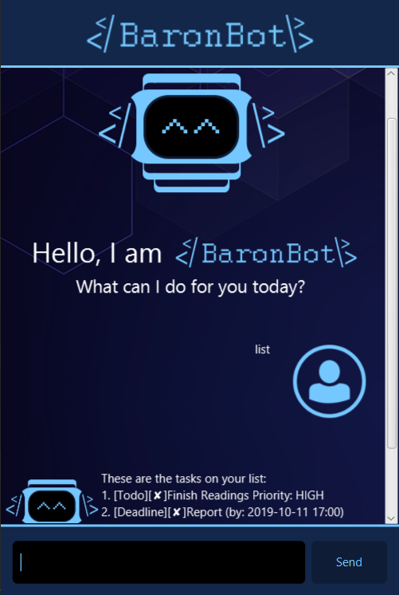

# User Guide for BaronBot


## BaronBot
BaronBot is a taskbot that helps you manage your tasks. You can keep track of things to do, deadlines and events. You can track each tasks level of importance as well!

## Features

### Adding tasks
1. `add` - Add a task

   Prompts you to enter a type of task.
   
   Example of usage: `add`
   
   Expected outcome: 
   
   ```
   What kind of task is it?
    - Todo
    - Deadline
    - Event
   ```

2. `[TASK TYPE]` - Add a task type.

   Adds a task type and prompts you for a description.
    
   Example of usage: `todo`
   
   Expected outcome: 
   
   ```
   Please enter the task.
   ```

3. `[DESCRIPTION]` - Add a task description.

   Adds a description to the task and stores it.
   
   There are 3 formats for descriptions:
   * Todo: `[DESCRIPTION]`
   * Deadline: `[DESCRIPTION], [DD/MM/YYYY] [HHMM]`
   * Event: `[DESCRIPTION], [DD/MM/YYYY] [HHMM]-[HHMM]` 
    
   Example of usage: `Team Meeting, 18/09/2020 1800-1900`
   
   Expected outcome: 
   
   ```
   Alright, I've added this task:
   [Event][✗] Team Meeting (at: 18 Sep 2020, 1800-1900) - Priority: UNDEFINED
   ```
## Marking task as completed

1. `done` - Mark a task as complete

   Prompts you to enter the task number that you want marked as completed.
   
   Example of usage: `done`
   
   Expected outcome: 
   
   ```
   Which task do you want to mark as done?
   ```

2. `[TASK NUMBER]` - Select the task to mark.

   Marks the task with that task number on your list as completed.
    
   Example of usage: `3`
   
   Expected outcome: 
   
   ```
   Good job! This task is now marked as done:
   [Event][✓] Team Meeting (at: 18 Sep 2020, 1800-1900) - Priority: UNDEFINED
   ```

### Deleting tasks

1. `delete` - Delete a task

   Prompts you to enter the task number that you want to delete.
   
   Example of usage: `delete`
   
   Expected outcome: 
   
   ```
   Which task do you want to delete?
   ```

2. `[TASK NUMBER]` - Select the task to delete.

   Delete the task with that task number on your list.
    
   Example of usage: `3`
   
   Expected outcome: 
   
   ```
   Alright, the following task has been removed:
   [Event][✓] Team Meeting (at: 18 Sep 2020, 1800-1900) - Priority: UNDEFINED
   You now have 2 tasks on your list.
   ```

### Finding tasks

1. `find` - Find tasks

   Prompts you to enter a keyword.
   
   Example of usage: `find`
   
   Expected outcome: 
   
   ```
   What are you trying to find? Search using a keyword.
   ```

2. `[KEYWORD]` - Find the matching tasks.

   Find the tasks that match the keyword.
    
   Example of usage: `Buy`
   
   Expected outcome: 
   
   ```
   These are the tasks that match the keyword:
   1. [Todo][✓] Buy eggs - Priority: MEDIUM
   2. [Todo][✗] Buy milk - Priority: LOW
   ```

### Assigning priority levels

1. `priority` - Assign a priority level

   Prompts you to enter the task number that you want to assign a priority level to.
   
   Example of usage: `priority`
   
   Expected outcome: 
   
   ```
   Which task do you want to assign a priority to?
   ```

2. `[TASK NUMBER]` - Select the task to assign to.

   Select the task and prompts you for priority level.
   
   There are 3 priority levels:
   * High
   * Medium
   * Low
    
   Example of usage: `3`
   
   Expected outcome: 
   
   ```
   What Level do you want to set it as?
    - High
    - Medium
    - Low
   ```

    The default priority level is assigned as "undefined".

3. `[PRIORITY LEVEL]` - Assign a priority level.

   Assigns a priority level to the selected task.
    
   Example of usage: `High`
   
   Expected outcome: 
   
   ```
   Alright, the following task priority has been updated:
   [Event][✗] Team Meeting (at: 18 Sep 2020, 1800-1900) - Priority: HIGH
   ```

### Getting help with commands
`help` - List all the commands

List all the commands you can use.

Example of usage: `help`

Expected outcome:
```
Here are the commands you can use:
1. Help
2. List 
3. Add
4. Done
5. Delete
6. Find
7. Priority
8. Bye
```

### Listing tasks

`list` - List all the tasks

List all the tasks stored on your list.

Example of usage: `list`

Expected outcome:
```
Here are the tasks in your list: 
1. [Todo][✓] Buy eggs - Priority: MEDIUM
2. [Todo][✗] Buy milk - Priority: LOW 
3. [Event][✗] Team Meeting (at: 18 Sep 2020, 1800-1900) - Priority: HIGH
```

### Exiting the program 
`bye` - Exits the program

Exits the program.

Example of usage: `bye`

Expected outcome:
```
Bye! See you around
```
